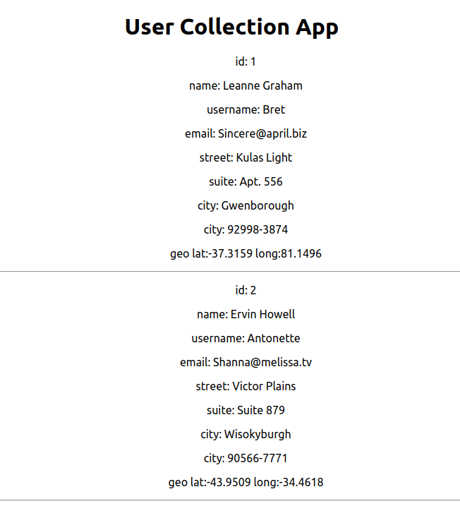

# react-collections-cw
You will be rendering from a people JSON collection. Use the test database content provided in this project and produce output similar to the example in the screenshot below.

- Create a new top level `AppContainer` component that reads in the JSON array of objects and stores the reference in a variable (hint: copy the data file to your `components` directory and use require())

- In top level component, map each entry to a separate `UserInformation` child component that will render the HTML. Each person object from the file should be passed down to the child `UserInformation`component to be rendered. (Note: don't forget about the `key` property when doing your `map()`)

### Challenge
1) Console log the `key` property of any row clicked with the mouse
2) Toggle the background color of your choice on and off for any row clicked with the mouse

